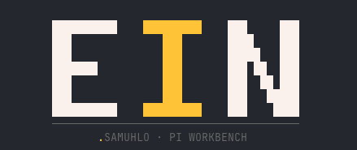

<div align="center">
  
  <h1><code>./EIN.sh</code></h1>

**Un harness de coding-agent para Pi Coding Agent y Claude Code: dos runtimes aislados, una disciplina de entrega.**

[Documentación](https://samuhlo.github.io/ein-agent/) ·
[Releases](https://github.com/samuhlo/ein-agent/releases/latest) ·
[Changelog](CHANGELOG.md) ·
[Issues](https://github.com/samuhlo/ein-agent/issues)

`BETA`

</div>

---

Ein convierte trabajo ambiguo en cambios **pequeños, verificados y explicados**.

No es un agente ni un modelo: es la capa que rodea al agente para que el trabajo salga en piezas revisables, con el estado del cambio en disco y no en la conversación.

> _note: aislamiento primero. `pi` y `claude` siguen siendo tus runtimes vanilla; Ein entra por superficies explícitas, no por contaminación silenciosa._

## // 00_ QUICK_START

```bash
curl -fsSL https://raw.githubusercontent.com/samuhlo/ein-agent/main/installer/install.sh | bash
ein
```

El menú pregunta el runtime: **Pi**, **Claude Code** o **Both**. Sin menú: `ein install --runtime pi|claude|both`.

Guía completa en [Getting Started](https://samuhlo.github.io/ein-agent/00-start/getting-started/).

## // 01_ EL_PROBLEMA

Pides "arregla el login". El agente toca ocho ficheros y devuelve 400 líneas con un resumen optimista. Revisarlo cuesta más que haberlo escrito. Y al cerrar la conversación, el razonamiento se va con ella.

Ein ataca las dos cosas: parte el trabajo en fases con contrato, y deja el estado en `openspec/` para que otra sesión, otra máquina u otro runtime lo retomen.

## // 02_ RUNTIME_SURFACE

| ELECCIÓN | SUPERFICIE | HOGAR DE EIN | RUNTIME VANILLA |
| :--- | :--- | :--- | :--- |
| **Pi** | `ein-pi` | `~/.pi-ein/agent` | `pi` → `~/.pi/agent` |
| **Claude Code** | `ein-cc` | `~/.claude-ein` | `claude` → `~/.claude` |
| **Both** | ambas | ambos hogares | ambos intactos |

Comparten el núcleo, **no las capacidades**. Las diferencias, sin maquillar, en la [matriz de runtimes](https://samuhlo.github.io/ein-agent/03-runtimes/runtime-matrix/).

## // 03_ SDD_ENGINE

```text
scope → map → design → tasks → apply → verify → close
```

Cada fase la ejecuta un subagente acotado y deja un artefacto en `openspec/changes/<cambio>/`. El parent decide, enruta y explica; no escribe el código.

Y hay comprobaciones que no dependen del modelo: el estado de las fases lo calcula una herramienta, no una opinión.

> _note: qué garantiza Ein y qué solo observa está escrito sin rebajas en [límites deterministas](https://samuhlo.github.io/ein-agent/01-concepts/deterministic-boundaries/)._

## // 04_ BLUEPRINT

```text
ein-agent/
├── ein-pi/
│   ├── core/       # agentes, skills, docs y prompts compartidos
│   ├── agent/      # extensiones, chains y runtime específico de Pi
│   ├── ein-pi.fish # acceso directo avanzado
│   └── migrate.ts  # migración del hogar Pi
├── ein-cc/         # CLAUDE.md, hooks, sync y CLI SDD del adaptador Claude
├── docs-site/      # documentación pública (Astro + Starlight)
└── installer/      # CLI, TUI, paths, deploy, backups y releases
```

`ein-pi/core/` (contenido portable, agnóstico del runtime) se comparte entre los dos adaptadores soportados. `ein-pi/core/` + `ein-pi/agent/` son la única fuente versionada del workbench; `installer/scripts/bundle-template.ts` los compone para el despliegue.

| LAYER | TECH |
| :--- | :--- |
| **Runtimes** | Pi Coding Agent · Claude Code |
| **Core** | TypeScript + Bun |
| **Workflow** | OpenSpec + SDD |
| **Docs** | Astro + Starlight |
| **Delivery** | GitHub Actions |

## // 05_ COMMAND_DECK

```bash
ein                 # abre la aplicación: estado del proyecto y arrancar a trabajar
ein-install update  # actualiza Ein y su template con backup
ein doctor          # diagnostica el despliegue
ein restore         # restaura desde un backup
ein uninstall       # elimina Ein y conserva auth, secrets y sesiones
```

`ein` es la única puerta. Los verbos de ciclo de vida los ejecuta `ein-install`,
que sigue en el `PATH` como arranque y escotilla de reparación: si lo que está
roto es `ein`, la reparación no puede pasar por `ein`.

```bash
ein-install         # instala, preguntando solo el runtime
ein-install doctor  # el mismo diagnóstico, sin depender de la aplicación
ein-install update --channel alpha   # cambia a alpha y la deja como preferencia
ein-install update --channel stable  # vuelve a estable y la deja como preferencia
```

Sin `--channel`, `update` reutiliza la preferencia guardada. Un `--dry-run`
resuelve el canal indicado para enseñar el resultado, pero no cambia esa
preferencia.

Referencia completa en [CLI](https://samuhlo.github.io/ein-agent/04-reference/cli/).

Acceso directo avanzado, sin pasar por la aplicación:

```bash
ein-pi             # Ein sobre Pi
ein-cc             # Ein sobre Claude Code
ein-cc-sdd status  # canal determinista SDD de Claude
```

## // 06_ DOCS

| | |
| :--- | :--- |
| [Overview](https://samuhlo.github.io/ein-agent/00-start/overview/) | qué es y para quién |
| [Getting Started](https://samuhlo.github.io/ein-agent/00-start/getting-started/) | instalar y comprobar |
| [First Run](https://samuhlo.github.io/ein-agent/00-start/first-run/) | un cambio real de principio a fin |
| [Workflow](https://samuhlo.github.io/ein-agent/02-workflow/workflow-overview/) | las siete fases |
| [Runtimes](https://samuhlo.github.io/ein-agent/03-runtimes/runtime-overview/) | Pi, Claude Code y sus diferencias |
| [Limitaciones](https://samuhlo.github.io/ein-agent/05-debug/known-limitations/) | qué está probado y qué no |

## // 07_ ESTADO

Beta. El registro mantenido de qué está probado, con qué evidencia y qué puede cambiar es [`docs/roadmap.md`](docs/roadmap.md). El rumbo que no se negocia vive en [`MANIFIESTO.md`](MANIFIESTO.md).

Los cambios con impacto van al [CHANGELOG](CHANGELOG.md). Las releases se publican como tags `installer-v*` desde GitHub Actions.

## // 08_ LICENCIA

[MIT](LICENSE).

<div align="center">

<code>DESIGNED & CODED BY <a href="https://github.com/samuhlo">samuhlo</a></code>

<small>Lugo, Galicia</small>

</div>
