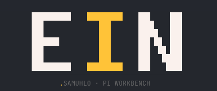

<div align="center">
  
  <h1>Ein · proyecto legado</h1>

**Un entorno de programación sobre Pi y Claude Code para convertir encargos ambiguos en cambios revisables.**

[El nuevo proyecto: n_ein](https://github.com/samuhlo/n_ein) ·
[Documentación de Ein](https://samuhlo.github.io/ein-agent/) ·
[Última release de Ein](https://github.com/samuhlo/ein-agent/releases/tag/installer-v0.99.1) ·
[Qué aprendí](docs/legacy-retrospective.md)

`LEGACY · versión final 0.99.1 · sin desarrollo de nuevas funciones`
</div>

---

Ein fue mi laboratorio para aprender a construir un entorno de agentes de programación de principio a fin: flujo de trabajo, adaptadores para dos runtimes, interfaz de terminal, instalador, recuperación, tests, evaluaciones y distribución. Sigue disponible como referencia y como instalación de su última versión. El desarrollo activo continúa en **[n_ein](https://github.com/samuhlo/n_ein)**, que conserva las partes útiles y simplifica el flujo diario.

## // 00_ EL PROBLEMA

Un agente puede terminar una tarea y, aun así, dejar un cambio difícil de revisar: decisiones implícitas, demasiados archivos tocados, pruebas resumidas sin evidencia y contexto que desaparece al cerrar la sesión. Ein exploró una respuesta: definir el encargo, dividir el trabajo cuando hacía falta, registrar su estado en archivos y comprobar cada entrega de forma independiente.

## // 01_ QUÉ CONSTRUÍ

- **Un flujo proporcional.** Los cambios pequeños pueden ir directamente a implementación y verificación; los complejos pueden usar `scope → map → design → tasks → apply → verify → close`, con artefactos en `openspec/changes/<cambio>/`.
- **Estado comprobable.** Herramientas calculan el avance, validan artefactos y distinguen un resultado verificado de una afirmación del agente. Un `verify: pass` cubre el contrato declarado; no promete ausencia de errores.
- **Dos runtimes aislados.** Pi es el núcleo (`ein-pi`, `~/.pi-ein/agent`); Claude Code es un relevo opcional (`ein-cc`, `~/.claude-ein`). Los comandos y hogares normales `pi`/`~/.pi/agent` y `claude`/`~/.claude` quedan separados. La [matriz](https://samuhlo.github.io/ein-agent/03-runtimes/runtime-matrix/) documenta las diferencias.
- **Distribución recuperable.** `ein-install` instala, diagnostica, actualiza y restaura con copias de seguridad. `ein` abre la aplicación de terminal. El código está en TypeScript/Bun y la web en Astro/Starlight.

```text
ein-agent/
├── runtime/       política, agentes y skills propias
├── shared/        contratos y lógica compartidos
├── vendor/skills/ skills de terceros identificadas
├── ein-pi/        integración con Pi
├── ein-cc/        integración con Claude Code
├── installer/     binarios, instalación y recuperación
├── tests/         contratos y regresiones
├── evals/         ensayos y límites observados
└── docs-site/     documentación pública
```

## // 02_ EVIDENCIA Y LÍMITES

| Caso | Qué se comprobó | Qué no demuestra |
| :--- | :--- | :--- |
| [Contrato de documentación](https://samuhlo.github.io/ein-agent/02-workflow/real-workflow-example/) | Un validador encontró una fuente omitida que dos verificaciones anteriores no habían detectado. | Que toda la documentación sea correcta por pasar un validador. |
| [Reducción de contexto](evals/orchestrator-context-2026-09-08.md) | En un ensayo controlado, la entrada inicial pasó de unas 41.100 a 23.800 tokens y el flujo siguió funcionando. | Un ahorro de coste total generalizable a otras sesiones. |
| [Instalador y releases](.github/workflows/installer-release.yml) | La publicación construye paquetes, ejecuta pruebas de instalación y genera checksums. | Compatibilidad con Windows o con cada entorno posible. |

Las [limitaciones conocidas](https://samuhlo.github.io/ein-agent/05-debug/known-limitations/) separan capacidades implementadas, pruebas realizadas y garantías que Ein no ofrece. El [changelog](CHANGELOG.md) conserva los cambios por versión. Las skills de terceros están en `vendor/skills/`, separadas del trabajo propio.

## // 03_ ÚLTIMA VERSIÓN

La última versión de este proyecto es [`installer-v0.99.1`](https://github.com/samuhlo/ein-agent/releases/tag/installer-v0.99.1). El [instalador](https://samuhlo.github.io/ein-agent/00-start/getting-started/) explica requisitos, comprobación y recuperación. Si ya tienes Ein, consulta sus notas antes de actualizar; los hogares de Ein y `n_ein` son independientes.

```bash
curl -fsSL https://raw.githubusercontent.com/samuhlo/ein-agent/main/installer/install.sh | bash
ein
```

Para reparar una instalación, el comando independiente es `ein-install doctor`. El código del repositorio puede probarse sin publicar con `bun run dev:install`; ese despliegue modifica una instalación de desarrollo, como explica [installer/README.md](installer/README.md#desarrollo).

## // 04_ POR QUÉ EXISTE n_ein

Ein enseñó que un contrato de fase y una prueba mecánica pueden descubrir errores reales. También mostró que siete fases fijas, delegación obligatoria y controles administrativos pueden costar más atención que la tarea que pretenden mejorar. **[n_ein](https://github.com/samuhlo/n_ein)** conserva launcher, instalador, identidad visual, continuidad Pi↔Claude, tareas visibles y prácticas de ingeniería; permite trabajo directo y delega cuando compensa. La [retrospectiva](docs/legacy-retrospective.md) explica las decisiones con ejemplos y evidencia, sin presentar el nuevo proyecto como una versión compatible de Ein.

## // 05_ DOCUMENTACIÓN Y LICENCIA

La [web](https://samuhlo.github.io/ein-agent/) documenta la versión final. [Arquitectura](https://samuhlo.github.io/ein-agent/01-concepts/orchestrator/), [flujo](https://samuhlo.github.io/ein-agent/02-workflow/workflow-overview/), [CLI](https://samuhlo.github.io/ein-agent/04-reference/cli/) y [recuperación](https://samuhlo.github.io/ein-agent/05-debug/uninstall-recovery/) siguen disponibles como referencia. El código propio se publica bajo [MIT](LICENSE); las dependencias y skills externas conservan sus licencias.

<div align="center"><small>Diseñado y desarrollado por <a href="https://github.com/samuhlo">Samuel López</a> · Lugo, Galicia</small></div>
