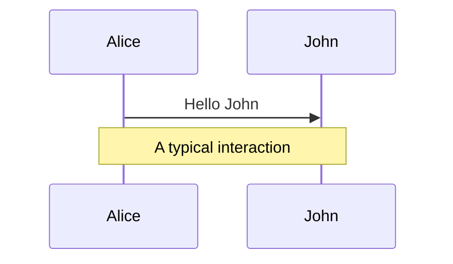
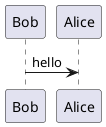

# Slidev — Code, Diagrams, Math & Icons

Sources: https://sli.dev/features/ (line-highlighting, shiki-magic-move,
twoslash, monaco-editor, mermaid, latex, icons)

## Code highlighting (Shiki)

````md
```ts
console.log('Hello, World!')
```
````

### Line highlighting

Static — highlight specific lines (1-indexed):

````md
```ts {2,3}
```
````

`{1,3}` non-consecutive, `{2-5}` range, `{all}`, `{none}`, `{hide}` (hide block).

Dynamic — advance highlight on each click with `|`:

````md
```ts {2-3|5|all}
```
````

### Line numbers & options

````md
```ts {all} {lines:true, startLine:5}
```
````

Use `{maxHeight:'200px'}` for scrollable blocks. Enable line numbers deck-wide
with `lineNumbers: true` in headmatter.

### Import code from a file

````md
<<< @/snippets/example.ts#region {2|4}
````

## Magic Move (animated code transitions)

Use **four backticks** and `magic-move`; each inner block is a step that morphs
into the next on click.

````md
`````md magic-move
```js
console.log(`Step ${1}`)
```
```js
console.log(`Step ${1 + 1}`)
```
```ts
console.log(`Step ${3}` as string)
```
`````
````

Options: title bar `magic-move [app.js]`; inline `magic-move {duration:500}`;
headmatter `magicMoveDuration: 500`; `magicMoveCopy: true | false | 'final'`.
Line highlighting works per step: `{*|1|2-5}`.

## TwoSlash (TS type info inline)

Enable with `twoslash` after the language. Hover shows types; use `// ^?` to pin.

````md
```ts twoslash
const name = 'Slidev'
//    ^?
```
````

## Monaco editor (live, editable code)

Add `{monaco}` to make a block editable; `{monaco-run}` to also execute it;
`{monaco-diff}` for a diff editor.

````md
```ts {monaco}
const a = 1
```

```ts {monaco-run}
console.log('runs in the slide')
```
````

## Mermaid diagrams

````md

````

Options object after the fence: `{theme:'neutral', scale:0.8}`. Single quotes for
string values, comma-separated keys.

## PlantUML

````md

````

## LaTeX / math (KaTeX)

Inline `$...$` and block `$$ ... $$`:

```md
Inline: $\sqrt{3x-1}+(1+x)^2$

$$
\begin{aligned}
\nabla \cdot \mathbf{E} = \frac{\rho}{\epsilon_0}
\end{aligned}
$$
```

Add `{1|2|3}`-style click reveals to equation lines with the LaTeX block options.
Chemical equations supported via mhchem.

## Icons (Iconify + unplugin-icons)

Install a collection, then use `<{collection}-{icon} />`:

```bash
npm i -D @iconify-json/mdi @iconify-json/carbon
```

```md
<mdi-account-circle />
<carbon-badge class="text-3xl text-red-400 mx-2" />
<logos-vue />
<uim-rocket class="text-3xl text-orange-400 animate-ping" />
```

Style like any HTML element with UnoCSS/Tailwind-style classes. Browse icons at
https://icones.js.org/.
