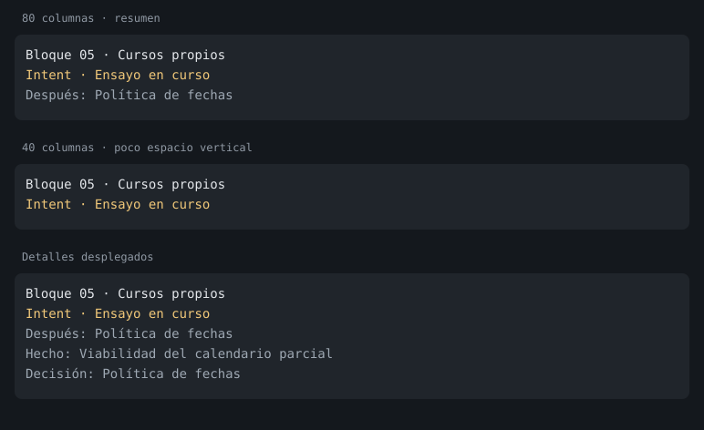

# Intent: evidencia autorizada y continuación — 14 de septiembre de 2026

## Problema y solución acotada

En el bloque 05, la primera respuesta autorizó un ensayo necesario para decidir
el calendario. El padre lo delegó como sdd-verify ordinario, cuyo gate exige intent
confirmado. Tras dos rechazos, volvió a pedir el permiso ya concedido. Además,
el TODO mezclaba hechos, permisos y decisiones en un contador y recortaba preguntas.

`ein_intent investigate` conserva la respuesta observada, también si ya pasó al
historial, y prepara un encargo de evidencia al sdd-verify existente. El acuerdo
de producto permanece pendiente. El padre valida el encargo contra su registro
de sesión; el hijo recibe raíces de lectura y comandos exactos. No se añade otro
agente, un scheduler ni otra cadena SDD. El ensayo es acotado y síncrono: su resultado
vuelve al padre en la misma ejecución para continuar las rondas.

Un rechazo técnico conserva la autorización. Reintentar dentro de los mismos límites
no necesita otra pregunta; ampliar las raíces de lectura requiere la autorización
correspondiente. El permiso de evidencia no admite scope, apply, otra forma de
ejecución ni un informe SDD. Los resultados fallidos siguen siendo observaciones;
no se convierten automáticamente en hechos resueltos o en verificación del producto.

`nextAction` distingue respuesta por incorporar, evidencia por preparar, ensayo
listo/en curso, resultado disponible y siguiente ronda. Una espera solo se muestra
como ensayo en curso después de observar su lanzamiento. Actualizar una ronda sin
preguntas es válido mientras depende de evidencia; el material omitido conserva
el alcance anterior, evitando reconstruirlo por un requisito de formato.

## TODO

El panel muestra título humano, actividad y siguiente paso, en hasta tres líneas.
El renderer recibe el ancho real de la TUI y reduce su altura en terminales pequeños.
Ctrl+Shift+E despliega detalles. No cuenta hechos ni permisos como decisiones de
producto y no muestra un porcentaje para nodos históricos sin clasificación.

La imagen compone las líneas devueltas por `renderIntentOverlay`; es una vista del
renderer, no una captura manual del terminal. Las pruebas invocan también el widget
con el ancho del host y comprueban expansión, reanudación y límites de líneas.

## Validación

- Suite completa: 3.253 pruebas, cero fallos. Tras el último ajuste de límites:
  57 pruebas focalizadas, cero fallos. Typecheck y empaquetado del template correctos.
- El prompt compacto del padre pasa de 7.839 a 7.619 bytes. Con las referencias
  reales inyectadas ocupa 7.948 bytes, dentro del límite de 8 KiB.
- `tests/intent-evidence.test.ts` reproduce selector → respuesta archivada → ensayo
  → rechazo técnico y recuperación con el mismo permiso → comando local real →
  siguiente ronda. Comprueba intent pendiente, producto intacto y ausencia de SDD.
  Rechaza scope/apply, tareas alteradas, ampliación de raíces con el mismo permiso,
  workflows incrustados, escrituras del hijo y comandos no incluidos en el encargo.
- `bun tooling/verify-intent-questionnaire.ts`: pasa con el plugin real instalado.
- `bun tooling/verify-intent-evidence.ts`: pasa con padre `openai-codex/gpt-6-astra`
  y verificador `openai-codex/gpt-5.6-luna`, usando sus esfuerzos configurados. Una
  única entrada inicia tres cuestionarios: permiso del ensayo, política de calendario
  después del resultado y revisión final. Solo hay un hijo y una ejecución local.
  El acuerdo termina confirmado sin otro «vamos», sin fase SDD ni cambios al producto.

El piloto usa el SDK de Pi, los hooks de producción, el plugin real con respuestas
programadas y un adaptador de subagent que crea una sesión hija real. La fixture
local solo calcula horas completas/parciales; no prueba el motor del proyecto del
usuario ni sustituye una prueba manual de la TUI o de todo pi-subagents.

La primera ejecución con el modelo detectó el rechazo de una ronda vacía y de un
material omitido; ambas transiciones se corrigieron y el recorrido completo se repitió.
La suite detectó el exceso de presupuesto del prompt: se acortó la política permanente
y se dejó el detalle en la skill, sin elevar el presupuesto.

## Límites y reversión

El modo limita herramientas, rutas de lectura y comandos; no introduce un sandbox
del sistema operativo. El padre debe preparar comandos locales conocidos y sin
efectos remotos: la lista exacta no demuestra por sí sola que un programa arbitrario
carezca de efectos secundarios. La interpretación de respuestas y resultados sigue
siendo del modelo; la máquina conserva su procedencia y evita cambiar el permiso
por un rechazo técnico. No se ha modificado la instalación personal.

El modo separado se justifica por el círculo reproducido entre evidencia pendiente
e intent confirmado. Podría retirarse si el mecanismo de ejecución general
representase permisos de investigación separados del acuerdo de producto con las
mismas pruebas. No se debe resolver quitando el gate de las fases SDD ordinarias.
